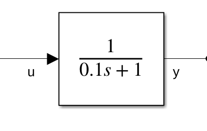
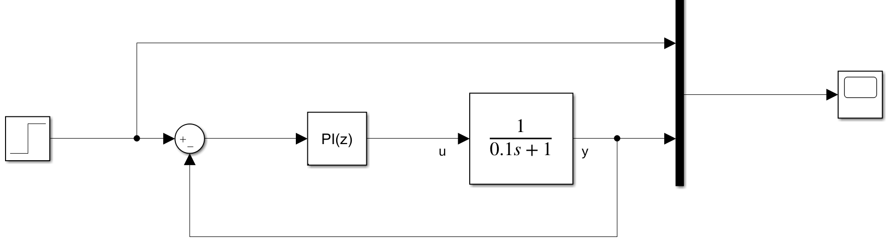
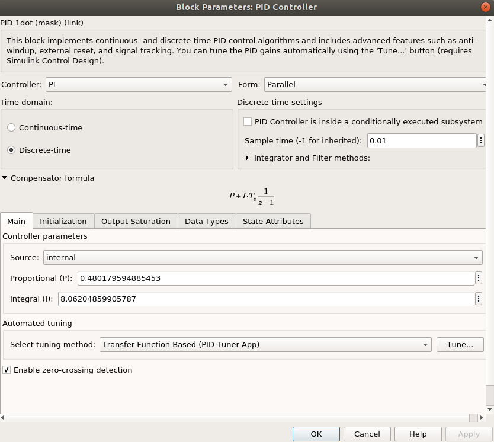
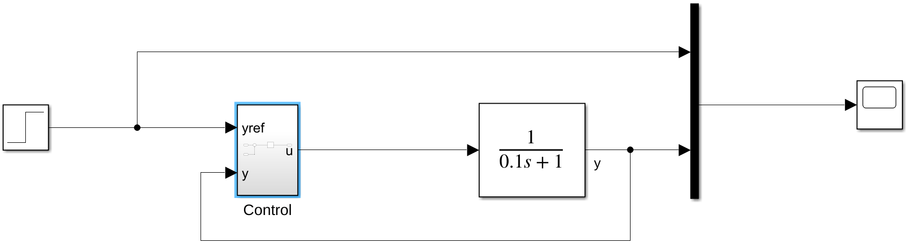
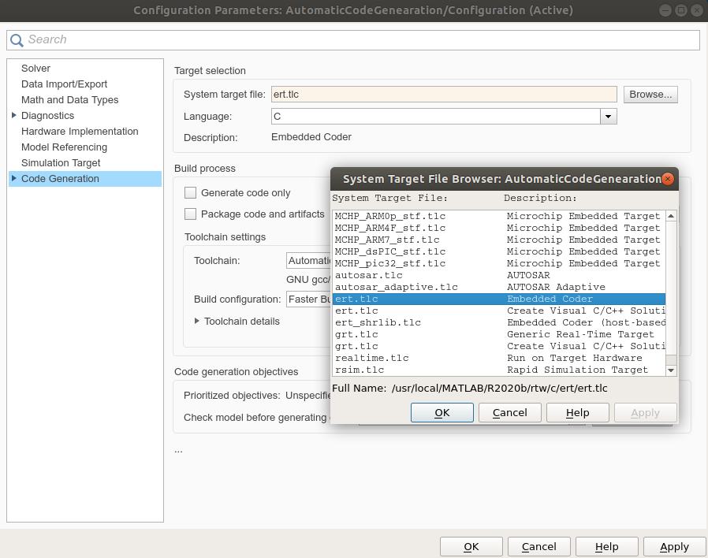
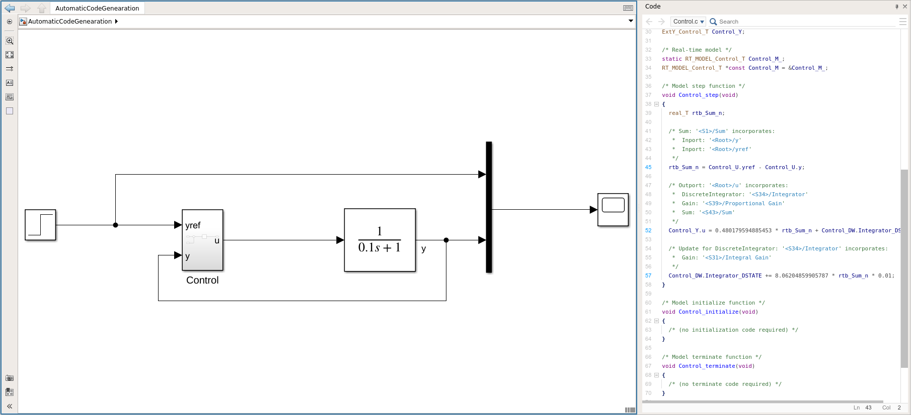

# Automatic code generation

For the section, the toolbox **Simulink Coder is required**

The objective is to automatically generate the C code of the controller to be implemented in the ESP32 board. 

For this purpose, let's consider a simple first order system



This open loop system has the time constant equal to 0.1 weather a settling time equal to 0.3 second.

For this example let's suppose that we want a closed loop system with the following specifications : 

- Stable closed loop system
- Precise
- A closed loop settling time equal to a open loop one.

To meet these specifications one choose a PI controller. Remember that the objective is to implement our controller on the ESP32, we will therefore choose a discrete time PI controller, with sampling time equal to **0.01s**.

 



To generate the code of the controller only, we create a subsystem for the controller.

 


To generate the code, first configure your Simulink model to choose the right code generator. We choose here **ert.tlc, Embedded coder**



 Right click on the subsystem, **C/C++ code > Build this subsystem**, a window opens, **Build code for Substem:Control**, click on build.

The generated code is displayed in a window on the left :



A step function is created :

```c
/* Model step function */
void Control_step(void)
{
  real_T rtb_Sum_n;

  /* Sum: '<S1>/Sum' incorporates:
   *  Inport: '<Root>/y'
   *  Inport: '<Root>/yref'
   */
  rtb_Sum_n = Control_U.yref - Control_U.y;

  /* Outport: '<Root>/u' incorporates:
   *  DiscreteIntegrator: '<S34>/Integrator'
   *  Gain: '<S39>/Proportional Gain'
   *  Sum: '<S43>/Sum'
   */
  Control_Y.u = 0.480179594885453 * rtb_Sum_n + Control_DW.Integrator_DSTATE;

  /* Update for DiscreteIntegrator: '<S34>/Integrator' incorporates:
   *  Gain: '<S31>/Integral Gain'
   */
  Control_DW.Integrator_DSTATE += 8.06204859905787 * rtb_Sum_n * 0.01;
}
```

We recognize here the code of the PI corrector. A structure **Control_U** is created for the inputs of the subsystem and a structure **Control_Y** for the outputs.

In the line :

```c
  Control_DW.Integrator_DSTATE += 8.06204859905787 * rtb_Sum_n * 0.01;
```

we clearly recognize the computation of the integral action.

This function (void Control_step(void)) must be integrated in the code of the ESP32, in the real time task. In the [previously downloaded code](/Programmes/ControlRobotESP_AP.zip). This PI controller is implemented in the **mode_cl()** function. All the Matlab generated code must be copy/past in the ESP32 code folder. The header of the **Control.c** file must be included in the code : 

```c
 extern "C" {
#include "Control.h"
}
```

The inputs and the outputs of the controller must be linked to the generated Matlab structures. If we consider a speed control. In the code we measure the motor1 speed (vel1) and we apply the control to the motor (com1). The **mode_cl()** function should looks like : 

```c
/* 
 * Mode Closed Loop
 */
void mode_cl() {
	
    // Update the control inputs
	Control_U.yref = ref_1; //ref_1 is the reference provided by the matlab interface.
    Control_U.y = vel1;
    // Compute the control
    Control_step();
    // Update the control output
    com1 = Control_Y.u
}
```

