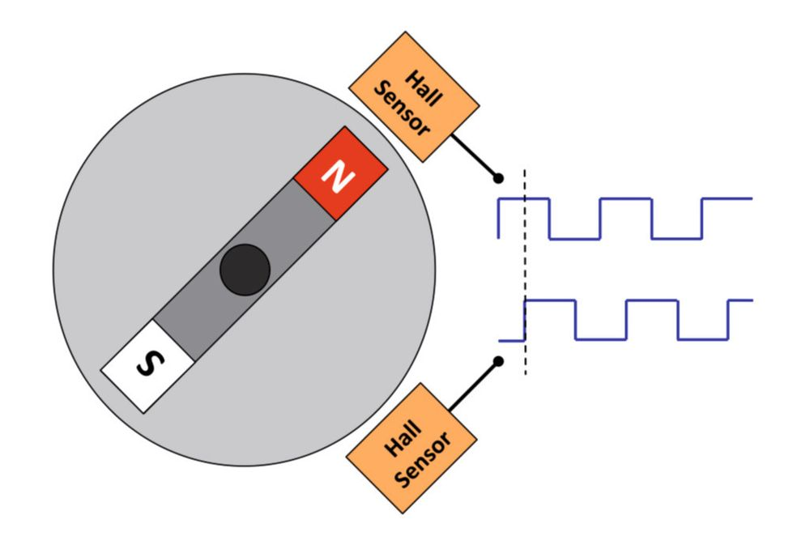
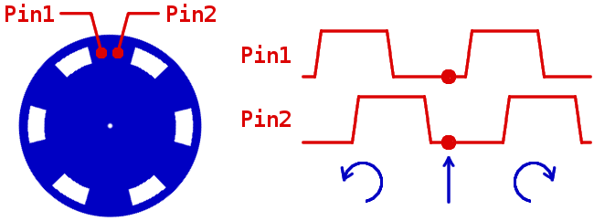

[Back to main page](/README.md)

# DC motor with encoder

The mobile robot is made up of two [DC motors with encoders](https://store.digilentinc.com/dc-motor-gearbox-1-53-gear-ratio-custom-6v-motor-designed-for-digilent-robot-kits/) and two [2A-H-bridge](https://reference.digilentinc.com/reference/pmod/pmodhb5/reference-manual)


[Back to main page](/README.md)

## PWM principle

The ESP32 has digital output only while to drive DC motor, it is necessary to apply analog voltage. It requires to convert digital to analog signals. For this we use a PWM (Pulse Width Modulation). The PWM is a technique used to reconstruct continuous signals using on / off circuits, e.g. Boolean outputs. A PWM signal is represented as :


The principle is to generate high frequency rectangular pulse wave. Over a period **T**, the pulse width can take a value between 0 and T. The pulse width  divided by the period T is called the duty cycle and is denote  on the figure. The average output voltage will therefore be equal to v (t) =  Vcc. This average voltage is shown in red in the figure. 

The voltage delivered by the ESP32 rages between **0** et **3.3v**. Using a 8-bits resolution, the duty cycle ranges between **0** and **255**. In practice, a voltage between **-Vmax** and **Vmax** needs to be applied on the motor, done using an H bridge. 

### H-bridge

The H-bridge circuit principle is the following : 


The H-bridge is a PmodHB5 whose block block diagram is :


The PmodHB5 utilizes a full H-Bridge circuit to allow users to drive DC motors from the system board. Two sensor feedback pins are incorporated into the motor connection header.

#### PWM control code 

The [LED control (LEDC)](https://docs.espressif.com/projects/esp-idf/en/latest/esp32/api-reference/peripherals/ledc.html) peripheral is primarily designed to control the  intensity of LEDs, although it can also be used to generate PWM signals  for other purposes. It has 16 channels which can generate independent waveforms that can be  used.

The following steps detail how to control the DC motor using PWM on ESP32.

- Declaring motor pins 

For motor pins table, refer the the [system description page](/SystemDescription.md). First define the GPIOs the motor pine are connected to.

```c
int motor1Enable = 32;
int motor1Dir = 16;
int motor2Enable = 33;
int motor2Dir = 17;    
```

- Program **setup()** function

In the **setup()**, first set the motor pins as outputs.

```c
pinMode(motor1Enable, OUTPUT);
pinMode(motor1Dir, OUTPUT);
pinMode(motor2Enable, OUTPUT);
pinMode(motor2Dir, OUTPUT);
```

 Configure PWM signal is done by setting the PWM channel, frequency and resolution as follow :

```c
ledcSetup(pwmChannel, freq, resolution);
```

In our case, we're generating a PWM signal at 2000Hz with a 8-bit resolution, on channel 0 for motor 1 and channel 1 for motor 2. 

Finally, the PWM signal is attached to the desired pin : 

```c
ledcAttachPin(motorxEnable, pwmChannel);
```

- **Moving the DC motor**

To apply different voltage to the motor, we need to change the PWM signal duty cycle. For that you use the ledcWrite()  function that accepts as arguments the PWM channel that is generating  the signal (not the output GPIO) and the duty cycle, as follows.

```c
ledcWrite(pwmChannel, dutyCycle);
```

- **Moving the DC motors forward or backwards**

To move the motor forward, you set motor**X**Dir pin to LOW, to move the motor backward, you set motor**X**Dir pin to HIGH.

```c
digitalWrite(motorXDir, LOW);
```

[Back to main page](/README.md)

## Encoder

Magnetic rotary encoders are devices that convert angular position into digital signals for use within measurement or control systems. Magnetic encoders use a combination of permanent magnets and magnetic sensors to detect movement and position. 



For this section refer to [PJRC website](https://www.pjrc.com/teensy/td_libs_Encoder.html) : Encoders can sense movement in either direction, by detecting holes or marks as they move past 2 positions.  When the blue disc in the diagram below spins clockwise, the changes are first detected by pin 1, and then by pin 2.  When it spins counterclockwise, pin 2 is first to detect changes.  This scheme is called "quadrature encoding" because the waveforms detected by the 2 pins are 90 degrees out of phase.



[Back to main page](/README.md)

## Sources

- [ESP-IDF Programming Guide](https://docs.espressif.com/projects/esp-idf/en/latest/esp32/index.html)](https://docs.espressif.com/projects/esp-idf/en/latest/esp32/get-started/index.html)
- ["ESP32 with DC Motor and L298N Motor Driver – Control Speed and Direction" ](https://randomnerdtutorials.com/esp32-dc-motor-l298n-motor-driver-control-speed-direction/)
- [Understanding Resolution in optical and magnetic Encoders ](https://www.elektronikpraxis.vogel.de/understanding-resolution-in-optical-and-magnetic-encoders-a-427263/)
- [PJRC Electronic Projects Components Available Worldwide](https://www.pjrc.com/teensy/td_libs_Encoder.html)

[Back to main page](/README.md)

