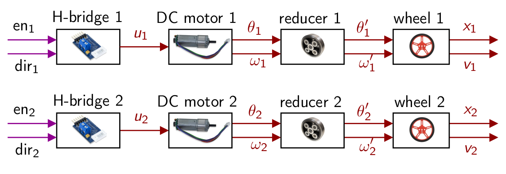
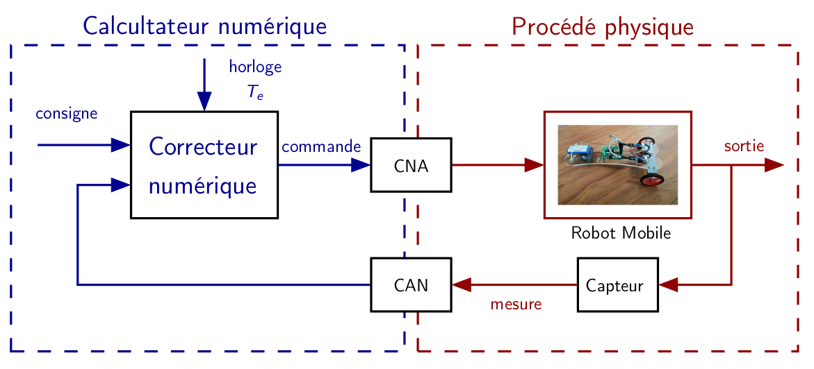
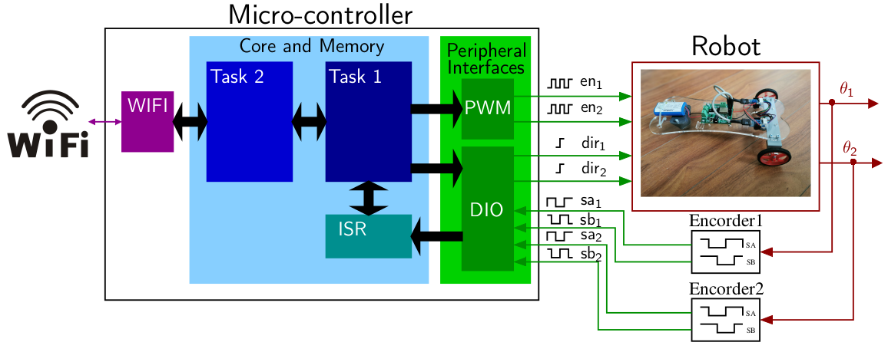

# Lab : Mobile Robot ESP32


This repository is dedicated to the development of a new mobile robot Lab proposed for student in the French engineering school [INSA Lyon](www.insa-lyon.fr). In a COVID context the objective is to propose automatic control lab which can be taught both in class and remotely in the event of confinement. The constraint is to be able to illustrate the basic automatic control principles on a simple system, without the need for software requiring a significant computing capacity.  During the lab, Matlab/Simulink:registered:  can be used to do the corrector synthesis, but the students can access it remotely using a VPN.

Given the specifications, our choice is directed to an ESP32 controller. This low cost device combines a dual core 160Mhz CPU and Wi-Fi. This makes it possible to embed a web server and that the students can realize the entire Lab using only an Internet browser.  

## Content

- [Contributors](#Contributors)
- [Lab objective](#objective)
- [Session 1](#session1)
- [Session 2](#session2)
- [Session 3](#session3)
- [Appendix](#appendix)
- [Sources](#sources)
- [License](#license)

## Contributors <a name="contributors"></a>

- Romain Delpoux (Romain.Delpoux at insa-lyon.fr), Associate Professor, INSA de Lyon, Laboratoire Ampère UMR CNRS 5005.
- Hiba Houmsi (Hiba.Houmsi at insa-lyon.fr), PhD student, INSA de Lyon, Laboratoire Ampère UMR CNRS 5005.
- Samar Alhaj Hassan (samar.alhaj-hassan@insa-lyon.fr), PhD student, INSA de Lyon, Laboratoire Ampère UMR CNRS 5005.
- Gaël Métras (gael.metras@insa-lyon.fr), Engineer, INSA de Lyon, Laboratoire Ampère UMR CNRS 5005.
- Pascal Bevilacqua (pascal.bevilacqua at insa-lyon.fr), Engineer, INSA de Lyon, Laboratoire Ampère UMR CNRS 5005.

## Lab objective <a name="objective"></a>

The Lab is divided into 3 sessions of 4 hours. 

1. Getting to know the system and the control environment (4h)
2. Robot speed control (4h)
3. Robot line follower (4h)

At the end of this project, students should be able to :

- Drive a DC motor with encoder
- Understand difference between open and closed loop systems.
- Understand how a real-time system works  (Tasks, Priorities, ...) 
- Identify a linear system 
- Simulate a linear system and compare with experimental data 
- Design and implement a control law (Simulation + Experimentation)
- Enjoy !!!

## Real Time Closed Loop Control  <a name="session1"></a>







## Session 1 <a name="session1"></a>

The objective of this first session is to discover the system. At the end of the session, the student should have 

- Learned about the Arduino programming environment for ESP32.
- Run both motors (forward, backward).
- Use encoders.
- Understand the open-loop behavior of the Robot
- Wi-Fi server

### System description

For system description goto : [System description page](/SystemDescription.md)

### Getting Started with the ESP32 Development Board

There’s an add-on for the Arduino IDE allows you to program the ESP32 using the Arduino IDE and its programming language : [Getting Started](/GettingStarted.md)

### DC motor with encoder

The tutorial to drive the DC motor can be found here : [DC Motor with encoder](/Motorwithencoder.md)

### Motor control over Wi-fi

To drive the system over Wi-Fi : [download the code](/Programmes/RobotoverWIFI.zip). 

The code is based on [ESP32 Access Point (AP) for Web Server tutorial](https://randomnerdtutorials.com/esp32-access-point-ap-web-server/). To use the code : 

- Make sure that you have change the **ssid** in the code

```c
const char* ssid     = "robotX";
```

- In your smartphone open your Wi-Fi settings and tap the **robotX** network.
- Open your web browser and type the IP address 192.168.4.1. The web server page should.

### ESP32 FreeRTOS

- [FreeRTOS](http://tvaira.free.fr/esp32/esp32-freertos.html)

## Session 2 <a name="session2"></a>

The objective of the lab is to implement a speed control so that the robot moves straight ahead. 

- Instructions are given here : [Closed Loop Control](Closedloopcontrol.md)

## Session 3 <a name="session3"></a>

The objective of the lab is to implement a angle tracking controller in addition to the speed controller developed at the previous lecture for the robot to follow the line, at constant speed.

- Instructions are given here : [Line follower tracking controller](LineFollower.md)

## Appendix <a name="appendix"></a>

To implement different control laws on the robot we propose here a solution for automatic code generation :

- [Automatic code generation](AutomaticCodeGeneration.md)

## Sources <a name="sources"></a>

- [https://randomnerdtutorials.com](https://randomnerdtutorials.com)
- [ESP32 + FreeRTOS](http://tvaira.free.fr/esp32/esp32-freertos.html)

## License <a name="license"></a>

The proposed materials on this repository are free of charge to use and is openly distributed, but note that

1.  Copyright owned by Romain Delpoux.
2.  The algorithms, or forks of the algorithms may not be re-distributed as a part of a commercial product unless agreed upon with the copyright owner. 
4. This work is distributed in the hope that it will be useful, but without any warranty, without event the implied warranty of merchantability or fitness for a particular purpose.


