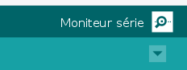

# Tutorial on Using the Arduino IDE

## Content

- [1. Structure of an Arduino Program](#struct)
- [ 2. Uploading a Program to Arduino](#upload)
- [3. Basic Functions](#basicFun)
  - [3.1 Serial Communication]( #serial)
  - [3.2 Digital Read and Write](#digital)
  - [3.3 Delay](#delay)
  - [3.4 Measuring Time Between Two Events](#measuringTime)

## 1. Structure of an Arduino Program <a name="struct"></a>

The basic structure of the code using Arduino IDE is as follows:


An Arduino program (called a "sketch") consists of two main functions:

```cpp
void setup() {
    // put your setup code here, to run once:
}

void loop() {
    // put your main code here, to run repeatedly:
}
```

-  `setup()`: The `setup()` function runs once at startup or after a reset. It is used to initialize inputs/outputs, serial communication, etc.
-  `loop()`: The `loop()` function runs in an infinite loop after `setup()`. It contains the core of the Arduino program.

## 2. Uploading a Program to Arduino<a name="upload"></a>

1. Write your code in the Arduino IDE.
2. Verify your code by clicking the "Verify" button (✓ icon).
3. Upload it to the board by clicking the "Upload" button (→ icon).

## 3.  Basic Functions<a name="basicFun"></a>

### 3.1 Serial Communication<a name="serial"></a>
Used to display debugging messages on the computer.

```cpp
void setup() {
    Serial.begin(9600); // Initialize at 9600 baud
    Serial.println("Arduino ready!");
}

void loop() {
    Serial.println("Loop message");
    delay(1000); // Wait 1 second
}
```

To visualize the result

- Clic on the **Serial Monitor** icon

    

- It may result in 

  

To display a value in the code : 

```cpp
Serial.print("Value: ");
Serial.println(value);
```

### 3.2 Digital Read and Write <a name="digital"></a>

Digital input and output are fundamental features of Arduino, allowing interaction with sensors, buttons, LEDs, and other components. 

- Setting Up Digital Pins 

  Before using a pin as input or output, you must configure it in the `setup()` function using `pinMode()`.

```cpp
void setup() {
    pinMode(2, INPUT);   // Set pin 2 as input
    pinMode(13, OUTPUT); // Set pin 13 as output
}
```

- Digital Read (Reading a Button State)

  `digitalRead(pin)` reads the state of a digital pin, which can be either HIGH (1) or LOW (0).

  **Example: Reading a Button**

  ```cpp
  const int buttonPin = 2;
  void setup() {
      pinMode(buttonPin, INPUT);
      Serial.begin(9600);
  }
  
  void loop() {
      int buttonState = digitalRead(buttonPin);
      Serial.print("Button State: ");
      Serial.println(buttonState);
      delay(500);
  }
  ```

  Using `INPUT_PULLUP`: If your button does not have an external pull-down resistor, you can use the internal pull-up resistor:

  ```cpp
  pinMode(buttonPin, INPUT_PULLUP);
  ```

  This inverts the logic: HIGH when not pressed, LOW when pressed.

-  Digital Write (Controlling an LED)

  `digitalWrite(pin, value)` sets a digital pin to HIGH (on) or LOW (off).

  **Example: Blinking an LED**

  ```cpp
  const int ledPin = 13;
  void setup() {
      pinMode(ledPin, OUTPUT);
  }
  
  void loop() {
      digitalWrite(ledPin, HIGH); // Turn LED on
      delay(1000);
      digitalWrite(ledPin, LOW);  // Turn LED off
      delay(1000);
  }
  ```

### 3.3 Delay<a name="delay"></a>

The `delay()` function in Arduino is used to pause the execution of a program for a specified number of milliseconds. This is useful for timing events, blinking LEDs, debouncing buttons, and more.

The syntax of `delay()` is:

```cpp
delay(milliseconds);
```

Where `milliseconds` is the number of milliseconds (1 second = 1000 milliseconds) the program should wait.

**Example: Blinking an LED**

```cpp
const int ledPin = 13;

void setup() {
    pinMode(ledPin, OUTPUT);
}

void loop() {
    digitalWrite(ledPin, HIGH); // Turn LED on
    delay(1000); // Wait 1 second
    digitalWrite(ledPin, LOW);  // Turn LED off
    delay(1000); // Wait 1 second
}
```

### 3.4 Measuring Time Between Two Events<a name="measuringTime"></a>

In some applications, it is necessary to measure the time elapsed between two events, such as button presses or sensor activations. The `millis()` or `micros()` functions in Arduino allow you to achieve this.

-  Using `millis()` for Millisecond Precision : The `millis()` function returns the number of milliseconds since the Arduino board started running the current program.

  **Example: Measuring Time Between Two Button Presses**

  ```cpp
  const int buttonPin = 2;
  unsigned long startTime = 0;
  unsigned long elapsedTime = 0;
  
  void setup() {
      pinMode(buttonPin, INPUT_PULLUP);
      Serial.begin(9600);
  }
  
  void loop() {
      if (digitalRead(buttonPin) == LOW) { // Button pressed
          if (startTime == 0) {
              startTime = millis(); // Start timing
              Serial.println("Timing started...");
          } else {
              elapsedTime = millis() - startTime;
              Serial.print("Elapsed time: ");
              Serial.print(elapsedTime);
              Serial.println(" ms");
              startTime = 0; // Reset for next measurement
          }
          delay(200); // Debounce delay
      }
  }
  ```

- Using `micros()` for Microsecond Precision : If higher precision is needed, `micros()` returns the number of microseconds (1 second = 1,000,000 microseconds) since the program started.

  **Example: Measuring Time with `micros()`**

  ```cpp
  unsigned long time1 = 0;
  unsigned long time2 = 0;
  
  void setup() {
      Serial.begin(9600);
  }
  
  void loop() {
      if (Serial.available()) {
          char c = Serial.read();
          if (c == 's') {
              time1 = micros();
              Serial.println("Start time recorded");
          }
          if (c == 'e') {
              time2 = micros();
              Serial.print("Elapsed time: ");
              Serial.print(time2 - time1);
              Serial.println(" microseconds");
          }
      }
  }
  ```

Using `millis()` or `micros()`, you can measure the time between two events with millisecond or microsecond precision. Choose `millis()` for human interactions like button presses and `micros()` for high-speed measurements.

